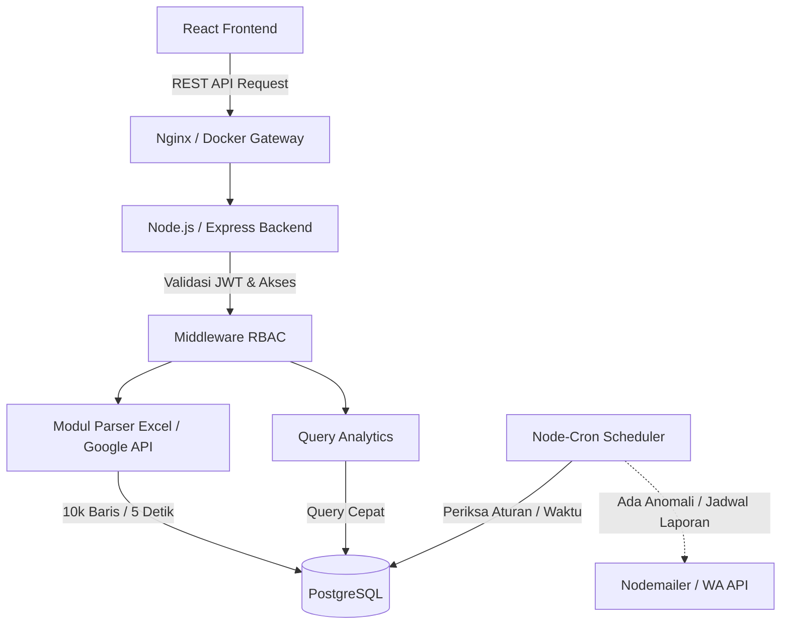
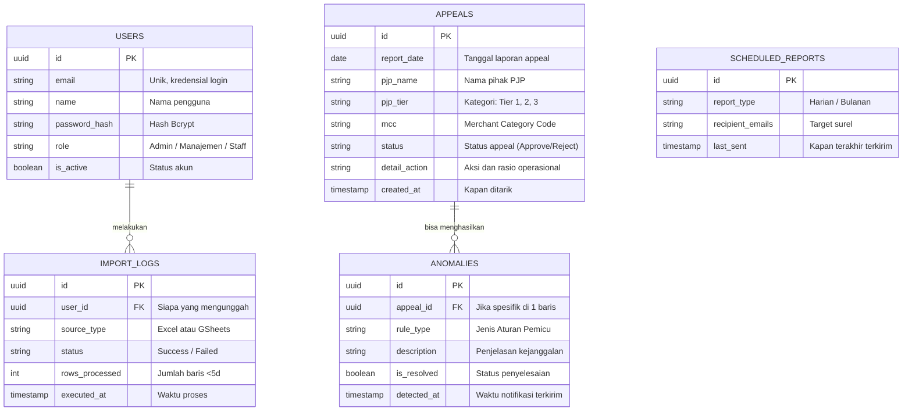

PRD — Project Requirements Document
1. Overview
Sistem Pengolahan & Dashboard Analisis Laporan Appeal Pendaftaran Merchant PJP (Penyedia Jasa Pembayaran) adalah sebuah aplikasi web-based full-stack. Aplikasi ini dirancang untuk menyelesaikan permasalahan alur kerja manual berbasis spreadsheet (Excel/Google Sheets) yang memakan waktu, rawan duplikasi, dan menyulitkan pemantauan secara real-time.
Tujuan utamanya adalah mengotomatiskan proses penarikan dan pengolahan laporan harian banding (appeal) merchant ke dalam database terpusat yang aman, serta menyajikan dasbor interaktif bagi tim Manajemen. Dasbor ini memungkinkan pemantauan visual instan terhadap operasional, tren, deteksi anomali otomatis, serta analisis strategis untuk mengoptimalkan sumber daya.
2. Requirements
Otomatisasi & Kinerja Tinggi: Sistem harus mampu mem-parsing data (misal 10.000 baris dari Excel) dalam waktu kurang dari 5 detik dengan logika upsert untuk mencegah duplikasi data saat ada revisi laporan.
Responsivitas Dashboard: Semua grafik, heatmap, dan statistik di aplikasi harus dirender dalam waktu kurang dari 2 detik sebagai respons filter dinamis.
Role-Based Access Control (RBAC): Terdapat 3 profil pengguna dengan hak akses ketat (Staff, Manajemen, dan Admin).
Proaktif & Terjadwal: Sistem harus mampu mengirim laporan analisis (harian/bulanan) dan notifikasi ketika mendeteksi anomali data (misal anjloknya jumlah pendaftaran di Tier 1) secara otomatis via Email/WhatsApp.
Multi-Sumber: Mampu menarik data baik dari unggahan file fisik Excel (`.xlsx`) maupun langsung dari sistem/tautan Google Sheets harian.
3. Core Features
Fitur-fitur aplikasi ini dikembangkan berdasarkan kerangka (roadmap) fase berikut:
Fase 1: Dashboard Analisis
Halaman utama untuk memantau data terbaru dan menganalisis tren appeal secara visual.
Ringkasan Data Terkini: Menampilkan jumlah appeal, status, dan ringkasan operasional hari ini dalam satu tampilan.
Grafik Volume Appeal: Grafik interaktif (line, bar) yang menunjukkan jumlah appeal per hari, bulan, atau tahun.
Filter Dinamis: Memfilter data berdasarkan tanggal, PJP, MCC, Tier, dan status untuk analisis spesifik.
Heatmap Kepadatan: Visualisasi heatmap hari dan tanggal untuk melihat kepadatan appeal secara instan guna optimasi tenaga kerja.
Top 10 & Distribusi: Menampilkan top 10 PJP, distribusi PJP/MCC, dan kategorisasi Tier (beserta rasio ACTION) dalam grafik.
Fase 2: Impor & Pengolahan Data
Mengotomatiskan pengambilan, validasi, dan penyimpanan data appeal dari berbagai sumber.
Unggah File Excel: Mengunggah file `.xlsx` laporan harian, divalidasi dan diproses otomatis (< 5 detik).
Integrasi Google Sheets: Menarik data dari tautan Google Sheets secara otomatis tanpa unduhan manual menggunakan API.
Validasi & Upsert: Memvalidasi integritas data, mencegah duplikasi, dan menjalankan upsert ke database terpusat.
Log Aktivitas Impor: Melihat riwayat unggahan, memantau status sukses, dan rincian kesalahan sistem/data setiap proses impor.
Fase 3: Manajemen Akun & RBAC
Mengelola akun, hak akses, dan keamanan sesuai peran pengguna.
Login & Logout: Autentikasi pengguna menggunakan JWT agar akses aplikasi tersertifikasi dan aman.
Atur Password: Memberikan fasilitas pada pengguna guna mengganti password akun masing-masing demi keamanan berkelanjutan.
Manajemen Pengguna: Admin dapat melihat, menambah, memodifikasi, dan mengatur peran/tier pengguna (Staff, Manajemen, Admin).
Proteksi Rute: Membatasi akses antarmuka, modul unggah, dan dasbor analitik spesifik berdasarkan peran yang dipegang pengguna secara ketat.
Fase 4: Laporan Terjadwal & Deteksi Anomali
Laporan Terjadwal:
Konfigurasi Laporan: Mengatur jadwal (harian, bulanan), format ringkasan, dan menentukan daftar penerima email distribusi.
Pengiriman Otomatis: Sistem secara otomatis mengirim laporan analisis ringkas via surel tepat pada konfigurasi waktu yang ditentukan.
Riwayat Pengiriman: Melihat catatan/log keberhasilan sistem dalam mendistribusi laporan otomatis.
Deteksi Anomali & Notifikasi:
Aturan Anomali: Menetapkan batasan kejanggalan secara custom (misal, jika jumlah PJP Tier 1 turun hingga 0, atau lonjakan data sangat abnormal).
Deteksi Real-Time: Modul yang memeriksa anomali segera di setiap kali pasca-proses impor selesai.
Notifikasi Insiden: Apabila anomali terdeteksi, pengiriman alert real-time langsung disebar via surel atau integrasi WhatsApp ke tim operasional.
Log Anomali: Dokumentasi riwayat anomali yang ditangkap sistem sebagai basis pendalaman analisis.
4. User Flow
Autentikasi (Semua Pengguna):
Pengguna masuk (Login). Sistem mengecek profil (Admin / Manajemen / Staff) dan mengarahkan ke halaman yang sesuai otoritas.
Unggah Data Operasional (Staff Pengunggah):
Staff memilih menu Impor Data harian.
Mengunggah file `.xlsx` atau mengeklik tombol "Tarik Data dari Google Sheets".
Sistem merespons dalam hitungan detik mengenai status kesuksesan/duplikasi. Peta aktivitas tercatat di "Log Aktivitas".
Pemantauan Dasbor (Manajemen / Admin):
Pengguna masuk menu Dashboard Analisis (waktu muat < 2 detik).
Melihat Ringkasan Terkini, melirik Grafik Top 10 PJP dan Heatmap kepadatan.
Memilih rentang tanggal, PJP, atau MCC lewat opsi filter agar grafik otomatis diperbarui.
Deteksi Anomali (Sistem di Latar Belakang):
Jika saat Staff mengunggah data terjadi anomali berdasar aturan Admin (mis. PJP Tier 1 berjumlah 0), sistem secara otomatis memicu email insiden ke grup operasional.
Administrasi Sistem (Admin):
Mengakses area Manajemen Pengguna untuk membuat akses bagi Manajer baru.
Mengakses panel atur batas anomali dan mengatur surel penerima laporan otomatis.
5. Architecture
Aplikasi mengusung arsitektur Client-Server modern antara Frontend (React) dan Backend (Express / Node.js). Node.js menangani integrasi Google API dan parser Excel secara efisien sebelum disimpan di PostgreSQL.

6. Database Schema
Koleksi data disimpan menggunakan sistem relasional PostgreSQL, yang sangat kuat untuk menangani Query analitik dan menjamin keutuhan data (ACID).

7. Tech Stack
Berikut adalah susunan teknologi spesifik yang akan digunakan dan dikontainerisasi:
Frontend:
Framework: React.js (menggunakan React Hooks & Context API)
Styling: Tailwind CSS (atau React-Bootstrap)
Routing & Fetching: React Router DOM, Axios
Visualisasi & UI: Recharts (atau react-chartjs-2) untuk grafik interaktif; React-Hot-Toast (atau SweetAlert2) untuk notifikasi pengguna.
Backend:
Framework: Node.js berbekal Express.js
Autentikasi & Keamanan: JsonWebToken (JWT), Bcrypt.js, Express-validator
Pengolah Data Eksternal: `exceljs` atau `xlsx`, `googleapis` (Khusus GSheets)
Notifikasi & Job Asinkron: Nodemailer, `node-cron` (atau Bull untuk queue/background job)
Logging: Winston atau Morgan
Database: PostgreSQL (dikendalikan via library `pg`)
Deployment & Infrastruktur: Docker & Docker Compose (Containerization)